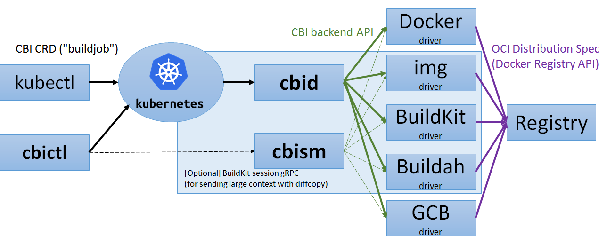

# CBI: Container Builder Interface for Kubernetes

CBI provides a vendor-neutral interface for building (and pushing) container images on top of a Kubernetes cluster,
with support for several backends such as [Docker](https://www.docker.com), [img](https://github.com/genuinetools/img), [BuildKit](https://github.com/moby/buildkit), and [Buildah](https://github.com/projectatomic/buildah).

## Current status

* CBI CRD: pre-alpha
* CBI daemon (CBID): pre-alpha
* CBI backend API: pre-alpha

* Backends (all of them are pre-alpha or even hasn't been started to work on):

Driver | Support Dockerfile | Support `cloudbuild.yaml` | Support LLB
--- | --- | --- | ---
[Docker](https://www.docker.com) | Yes | |
[img](https://github.com/genuinetools/img) | Planned | |
[BuildKit](https://github.com/moby/buildkit) | Planned | Planned | Planned
[Buildah](https://github.com/projectatomic/buildah) | Planned | |
[OpenShift Image Builder](https://github.com/openshift/imagebuilder) | Planned | |
[Orca](https://github.com/cyphar/orca-build) | Planned | |
[Google Cloud Container Builder](https://cloud.google.com/container-builder/) | Planned | Planned |

Please feel free to open PRs to add other backends.

<!-- TODO: figure out possibility for supporting Bazel and OpenShift S2I. -->

## Quick start

Requires Kubernetes 1.9 or later.

To use the Docker backend, you need to have Docker installed on the nodes.

### Installation

```
$ ./hack/build/build-push-apply.sh your-registry.example.com:5000/cbi test20180501
```

This command performs:

* Build and push CBI images as `your-registry.example.com:5000/cbi/...:test20180501`
* Generate `artifacts/cbi.generated.sh` so that the manifest uses the images on `your-registry.example.com:5000/cbi/...:test20180501`.
    * `CustomResourceDefinition`: `BuildJob`
    * `ServiceAccount`: `cbid-serviceaccount`, ....
    * `ClusterRoleBinding`: `cbid-rbac`, ...
    * `Deployment`: `cbid-deployment`, ...
* Execute `kubectl apply -f artifacts/cbi.generated.sh`.

### Run your first `buildjob`

Create a buildjob `ex0` from [`artifacts/examples/ex0.yaml`](artifacts/examples/ex0.yaml):
```console
$ kubectl create -f artifacts/examples/ex0.yaml
buildjob "ex0" created
```

Make sure the buildjob is created:
```console
$ kubectl get buildjobs
NAME      AGE
ex0       3s
```

Inspect the underlying job and the result:
```console
$ kubectl get job $(kubectl get buildjob ex0 --output=jsonpath={.status.job})
NAME      DESIRED   SUCCESSFUL   AGE
ex0-job   1         1            30s
$ kubectl logs $(kubectl get pods --selector=job-name=ex0-job --show-all --output=jsonpath={.items..metadata.name})
Sending build context to Docker daemon 79.87 kB
Step 1 : FROM alpine:latest
...
Successfully built bef4a548fb02
```

Delete the buildjob (and the underlying job)
```console
$ kubectl delete buildjobs ex0
buildjob "ex0" deleted
```

### Advanced usage

To send a large build context using [BuildKit session gRPC](https://github.com/moby/buildkit/blob/9f6d9a9e78f18b2ffc6bc4f211092722685cc853/session/filesync/filesync.proto), with support for diffcopy (*UNIMPLEMENTED YET*):

```console
$ go get github.com/containerbuilding/cbi/cmd/cbictl
$ cbictl build -t your-registry.example.com/foo/bar:baz --push .
```

## Design

### Components

CBI is composed of the following components:

* CBI CRD: Kubernetes custom resource definition for `buildjob` objects.
* CBI daemon (`cbid`): a controller that watches creation of CBI CRD objects and creates [Kubernetes Job](https://kubernetes.io/docs/concepts/workloads/controllers/jobs-run-to-completion/#what-is-a-job) objects correspondingly.
* CBI CLI (`cbictl`): a reference CLI implementation for `cbid`
* CBI backend API: gRPC API used for connecting `cbid` to backend drivers.
* CBI backend drivers: the actual pods that build and push images.
* CBI session manager (`cbism`): pods that speak [BuildKit session gRPC](https://github.com/moby/buildkit/blob/9f6d9a9e78f18b2ffc6bc4f211092722685cc853/session/filesync/filesync.proto) for supporting large build context and diffcopy.

The concept of CBI session manager (`cbism`) is decoupled from `cbid`, so as to make `cbid` free from I/O overhead.



### Build context

CBI supports the following values for `context.kind`:

* `ConfigMap`: Kubernetes config map. Only suitable for small contexts.
* `Git`: git repository, with support for Kubernetes secrets 
* `BuildkitSession`: BuildKit session gRPC

However, some backend driver may not implement all of them.

#### Session

If `BuildkitSession` is specified as `context.kind`, the pod ID of a CBI session manager, TCP port number, and the session ID would be set to the status fields of the `BuildJob` object.

The client is expected to send the context to the specified session manager pod using BuildKit session gRPC (via [the HTTP/1.1 gate](https://github.com/moby/buildkit/blob/b7424f41fdf60b178c5227abdd54cb615161123d/session/manager.go#L46)).
To connect to the pod, the client may use `kubectl port-forward` or `kubectl exec ... socat`.

Future version would also provide [Ingress](https://kubernetes.io/docs/concepts/services-networking/ingress/) for exposing the CBI session manager in more efficient ways.

## Contribute to CBI

* Vendoring is managed via [godep](https://github.com/tools/godep), but will soon migrate to [dep](https://github.com/golang/dep).
* To update CRD definition, please edit [`pkg/apis/cbi/v1alpha1/types.go`](pkg/apis/cbi/v1alpha1/types.go) and run `hack/codegen/update-codegen.sh`. Please do not edit autogenerated files manually.

### Local testing with DinD

You may use `hack/dind/up.sh` for setting up a local Kubernetes cluster and a local registry using Docker-in-Docker.

```console
$ ./hack/dind/up.sh
$ DOCKER_HOST=localhost:62375 ./hack/build/build-push-apply.sh cbi-registry:5000/cbi test20180501
$ ./hack/dind/down.sh
```
The Kubernetes cluster and the "bootstrap" Docker listening at `localhost:62375` can connect to `cbi-registry:5000` without auth.


## FAQs

### Q: Does CBI standardize the Dockerfile specification?

A: No, the Dockerfile specification has been maintained by Docker, Inc.

CBI itself is neutral to any image building instruction language (e.g. Dockerfile).

However, most backend implementations would accept Dockerfile.

### Q: Does CBI replace BuildKit?

A: No, CBI just provides an abstract interface for several backends such as BuildKit.

### Q: Is CBI a part of Kubernetes, a Kubernetes incubator, or a CNCF project?

A: Currently no, unlike CRI/CNI/CSI.

But it'd be good to donate CBI to such a vendor-neutral organization if CBI becomes popular.
